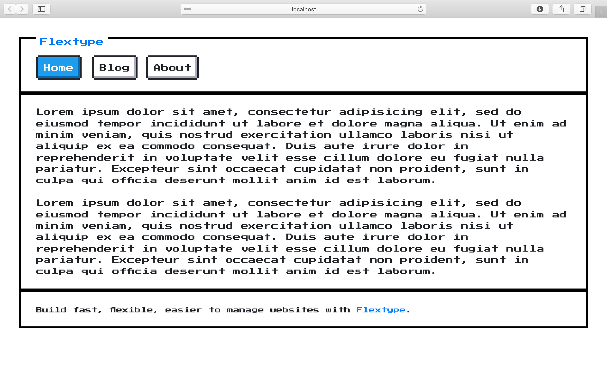

<h1 align="center">NES Theme for <a href="https://flextype.org/">Flextype</a></h1>

    

## Features

* NES.css - [NES-style(8bit-like)](https://github.com/nostalgic-css/NES.css) CSS Framework.

## Dependencies

The following dependencies need to be downloaded and installed for NES Theme.

| Item | Version | Download |
|---|---|---|
| [flextype](https://github.com/flextype/flextype) | 0.9.12 | [download](https://github.com/flextype/flextype/releases) |
| [site](https://github.com/flextype-plugins/site) | >=1.0.0 | [download](https://github.com/flextype-plugins/site/releases) |
| [twig](https://github.com/flextype-plugins/twig) | >=1.0.0 | [download](https://github.com/flextype-plugins/twig/releases) |

## Installation

1. Download & Install all required dependencies.
2. Create new folder `/project/themes/nes`
3. Download NES Theme and unzip theme to the folder `/project/themes/nes`
4. Update setting `theme` with new value `nes` in `/project/config/plugins/site/settings.yaml`

## LICENSE
[The MIT License (MIT)](https://github.com/flextype-themes/nes/blob/master/LICENSE.txt)
Copyright (c) 2021 [Sergey Romanenko](https://github.com/Awilum)
